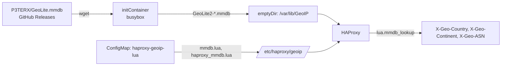

# HAProxy Ingress

HAProxy Ingress is an Ingress Controller that configures HAProxy to expose services to the outside world.

* [Site](https://haproxy-ingress.github.io/)
* [Documentation](https://haproxy-ingress.github.io/docs/)
* [Helm Chart](https://github.com/haproxy-ingress/charts)

## Configuration
Exposed via NodePort:
- HTTP: 30080
- HTTPS: 30443

## GeoIP (haproxy-lua-geoip2)

Enriches all incoming HTTP requests with geographic headers:
- `X-Geo-Country` — ISO country code (e.g., `RU`, `US`)
- `X-Geo-Continent` — continent code (e.g., `EU`, `NA`)
- `X-Geo-ASN` — AS number (e.g., `AS12345`)

### Setup

Базы GeoLite2 скачиваются при старте пода initContainer'ом напрямую из [P3TERX/GeoLite.mmdb](https://github.com/P3TERX/GeoLite.mmdb) (GitHub releases). **Регистрация в MaxMind не требуется.**

При каждом рестарте пода initContainer качает свежие `.mmdb` базы в `emptyDir`. Обновление баз происходит автоматически с каждым перезапуском DaemonSet (например, при обновлении образа HAProxy или ручном рестарте).

### How it works



### Troubleshooting

```bash
# Проверить, скачались ли базы
kubectl -n haproxy-ingress exec daemonset/haproxy-ingress -- ls -la /var/lib/GeoIP/

# Посмотреть логи initContainer'а
kubectl -n haproxy-ingress logs daemonset/haproxy-ingress -c geoip-download

# Перекачать базы (рестарт DaemonSet)
kubectl -n haproxy-ingress rollout restart daemonset/haproxy-ingress
```
